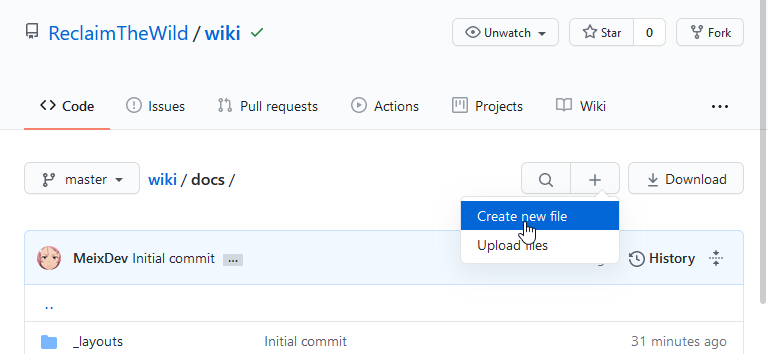
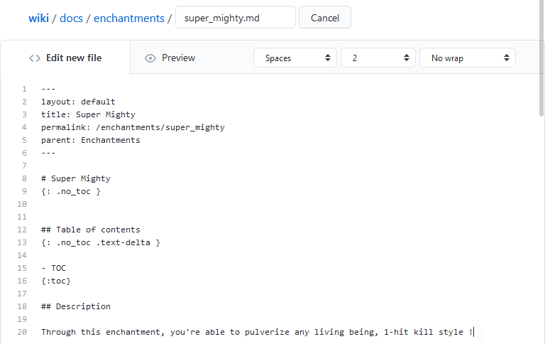
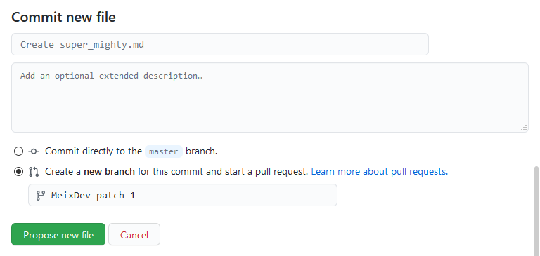
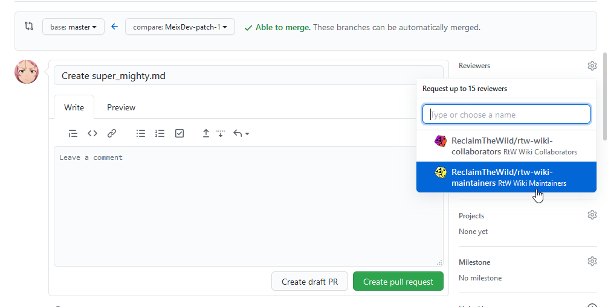
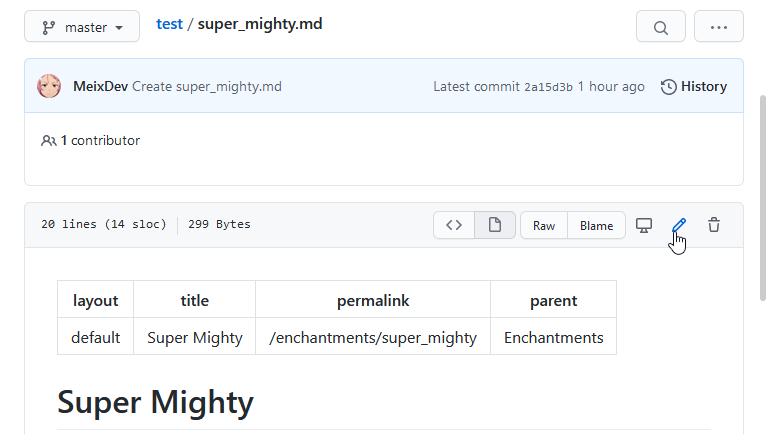

# Contributing
{: .no_toc }

## Table of contents
{: .no_toc .text-delta }

- TOC
{:toc}

## Submitting a new page

### GitHub & Organization

If you wish to submit a new page to the wiki, you'll need your own GitHub account.

You'll then need to ask access to ReclaimTheWild's organization and to be added to the Wiki Contributor's team to one of the organization maintainers.

The current ones are :

* [@MeixDev](https://github.com/MeixDev) aka Meï#4242

### Adding a file.

Once you're added to the organization as a Wiki Contributor, you can create a new file from the master Branch. You can access the root of wiki repository from [here](https://github.com/ReclaimTheWild/wiki/).

The root folder of the wiki is the docs/ folder. You will usually want to create a file in a subfolder, such as in the enchantments folder. Select the folder the more appropriate to the homebrew you want to create beforehand !

You can then select the create new file button.

From there, you can name your file (don't forget the Markdown identifier ".md"), and paste your article in the only editor. The specifications and templates for your articles are available on the [Syntax & Templates](syntax_templates.md) page.

Once you finished writing your file, you can commit it. Feel free to personalize the commit's name and description as fits your needs, then select the `Create a new branch from this commit and start a pull request` option. Normal collaborators won't be able to Commit directly to the master branch. Maintainers will be allowed to do so, but should still go through the normal process whenever possible.

From that page, you can add information about your Pull Request. Although it may not be useful to add information for simple pull requests, advanced users going through a different process may want to add informations, especially when the pull request concerns multiple files, or file editing.

From there, you must add RtW Wiki Maintainers as reviewers, and click on the Create pull request button.

Your request will then need approval from one of the maintainers before being merged. Feel free to poke one of the maintainers on Discord to speed up the process !

### Modifying a file.

Sometimes, you may want to edit a file, to make an update to one of your homebrew content, or to submit a fix to a typo, for example. In such cases, you'll want to go through the edit page way, directly from your page.

From there, the process is the same as the above one : Edit the file, submit the changes in a new PR. In such cases, it **is** important to explicitly declare the changes you've done, especially if it's not your file. If possible, you should add the original owner of the file as a reviewer for your Pull Request (in addition of a maintainer).

### The advanced way

If you're used to git, GitHub and versioning, feel free to create your own branches, do your stuff, push it and create a pull request for it. However, please be precise in your additions and modifications to make it easier  to process for the Pull Request.

### Becoming a Maintainer

If you're a trusted user of the Wiki (or a member of the official staff !), you can request to be added to the Maintainer team : It allows you to merge your own Pull Requests, and to review and merge other people Pull Requests. 