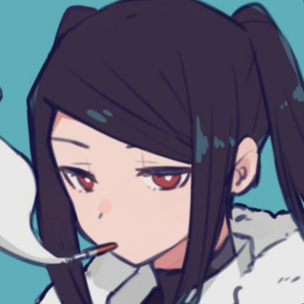

{: .float-right }

# Profile of \[Name]
{: .no_toc }

*The TOC should be optional, but could still be included if wanted. The image on the right should be an avatar the user want to be recognised with, with a square shape (Is it there reduced to a 150x150 size.)*
{: .text-purple-000}

  

    Table of contents
  

  {: .text-delta }
- TOC
{:toc}

## Summary

\[Quick Summary of the user if they wants to]

## Contributions

\[The contributions of the user. They're free to organize them of they see fit with headlines and stuff. The following is only an example]

*Users can totally choose to link to external documents there if they want to, but it would be cool to integrate it to the Wiki to add the global Search function to it !*
{: .text-purple-000}

### My Extension

* **[Awesome race](https://www.google.com)**: somethingsomethinh
* **[New functionnality 1](https://www.google.com)**: somethingsomethinh
* **[New functionnality 2](https://www.google.com)**: somethingsomethinh

### Misc

* **[Random Feat 1](https://www.google.com)**: somethingsomethinh
* **[Stylish Magic](https://www.google.com)**: somethingsomethinh
* **[A fitting monster from Megaman 8](https://www.google.com)**: somethingsomethinh

### Work-in-progress

* **[Cyberpunk stuff addendum](https://www.google.com)**: somethingsomethinh

### Things I contributed to

* **[Test](../enchantments/silvered)**: somethingsomethinh w/ NotMeï

## Media

\[If users want to share their Twitter art account, or simply specify "Hey btw I'm that dude#4321 on Discord !"]